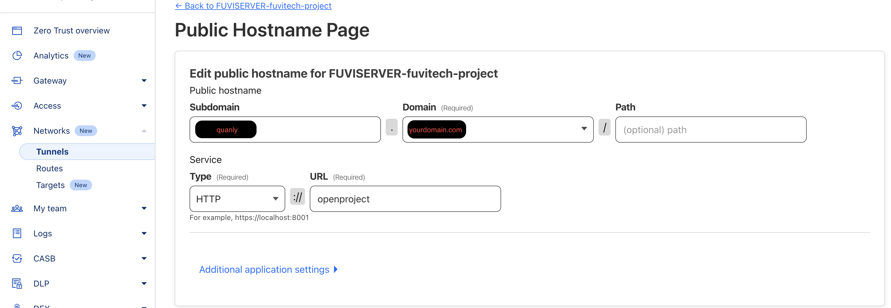

# OpenProject and Cloudflared Setup

This README provides instructions for setting up OpenProject alongside Cloudflare's Argo Tunnel using Docker.

## Services

### 1. Clone the Repository
```bash
git clone https://github.com/lovebmt/openproject-cf.git
cd openproject-cf
mkdir openproject
chmod -R 777 openproject
```
### 2. Set Environment Variables:
```bash
echo "OPENPROJECT_HOST_NAME=quanly.yourdomain.com" >> .env
echo "CF_TOKEN=your_cloudflare_token" >> .env
```
### 3. Start the Services
```yml
docker-compose up -d
```


### 4. Configure Cloudflare in the UI
- Log in to Your Cloudflare and config in Zero Trust


